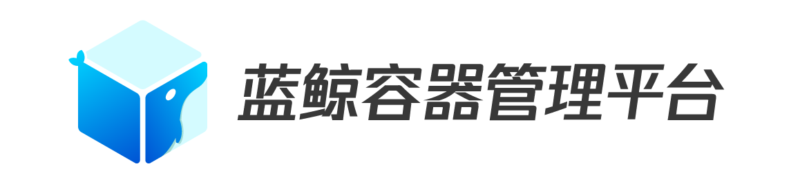

# 蓝鲸智云容器管理平台SaaS

   

[(English Documents Available)](README_EN.md)

蓝鲸智云容器管理平台(BCS，Blueking Container Service)是高度可扩展、灵活易用的容器管理服务。蓝鲸容器管理平台支持两种不同的集群模式，分别为原生Kubernetes模式和基于Mesos自研的模式。使用该平台，用户无需关注基础设施的安装、运维和管理，只需要调用简单的API，或者在页面上进行简单的配置，便可对容器进行启动、停止等操作，查看集群、容器及服务的状态，以及使用各种组件服务。用户可以依据自身的需要选择集群模式和容器编排的方式，以满足业务的特定要求。

本次开源的是蓝鲸智云容器管理平台的SaaS，它提供了友好的操作界面，支持对项目集群、节点、命名空间、部署配置、仓库镜像、应用等进行可视化界面操作管理，并提供了WebConsole可快捷查看集群状态的命令行服务，针对K8S集群模式支持使用Helm进行K8S应用的部署和管理。

蓝鲸智云容器管理平台的SaaS源码包含:
- bcs-app：SaaS产品层主体功能模块，负责项目集群、节点、命名空间、部署配置、仓库镜像、应用等进行可视化界面操作管理，以及WebConsole、Helm等服务
- bcs-cc：配置中心模块，负责集群版本、快照等信息管理
- bcs-projmgr：项目信息管理模块，负责项目创建及基本信息管理

## Overview

- [架构设计](docs/overview/architecture.md)
- [代码目录](docs/overview/project_codes.md)
- [部署拓扑](docs/overview/project_deploy.md)

## Features
- **集群管理**：支持自定义设定Master和Node节点，一键自动安装集群组件，按业务架构划分集群，保证安全可靠。支持动态伸缩，可以实时添加/剔除集群节点，支持集群和节点级别的监控告警及主要数据的视图展示
- **配置管理**：支持配置模板集的多版本管理，支持通过命名空间管理不同的环境
- **应用管理**：通过应用视图或者命名空间视图管理容器，查看应用、POD、容器等的在线状态。启停容器，重新调度容器，对应用做扩缩容、滚动升级等更新操作
- **镜像管理**：对接harbor镜像仓库，镜像信息在线管理
- **网络管理**：查看服务的列表，以及每个服务的详细信息，对服务进行操作，例如更新服务或者停止服务。查看线上负载均衡器列表，及每个负载均衡器的详细信息，启动、删除或者更新负载均衡器
- **WebConsole**：快捷查看集群状态的命令行工具服务
- **Helm**：支持K8S应用的部署和管理工具Helm

## Getting started
> 容器管理平台SaaS是蓝鲸智云社区版V5.1以上推出的产品，需要与蓝鲸社区版后台软件配合使用

> 目前社区版5.1在灰度内测中，若想体验，请填写问卷留下邮箱等信息，蓝鲸将在1-2个工作日通过邮箱方式，交付软件。感谢对蓝鲸的支持与理解
> 问卷链接：[https://wj.qq.com/s2/3830461/a8bc/](https://wj.qq.com/s2/3830461/a8bc/)

> 蓝鲸社区版5.1完全开放下载时间为2019-07-05

- [本地安装部署指引](/docs/install/dev-install-overview.md)
- [替换已安装的蓝鲸社区版指引]()

## Release

- [版本日志](docs/release.md)

## Support

- [产品白皮书](https://docs.bk.tencent.com/bcs/)
- [蓝鲸论坛](https://bk.tencent.com/s-mart/community)
- 联系我们，技术交流QQ群：

## Contributing

关于分支/issue及PR, 请查看 [CONTRIBUTING](docs/CONTRIBUTING.md)

[腾讯开源激励计划](https://opensource.tencent.com/contribution) 鼓励开发者的参与和贡献，期待你的加入。

## FAQ

请查看 [FAQ](docs/faq.md)

## License

基于 MIT 协议， 详细请参考[LICENSE](LICENSE.txt)
