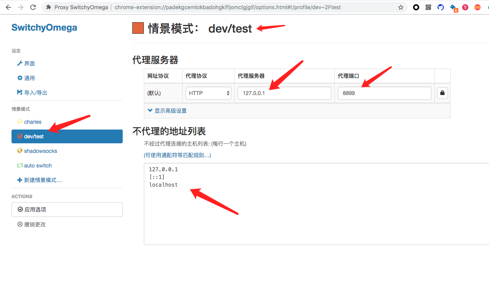
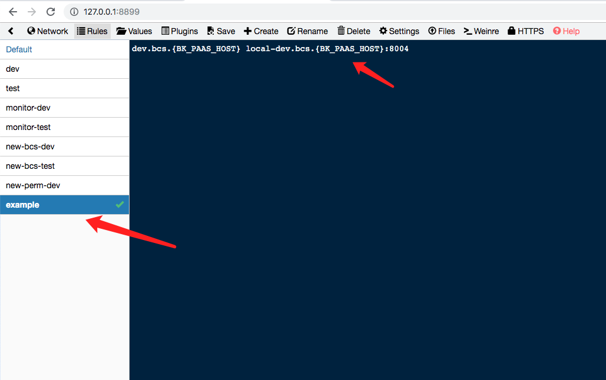
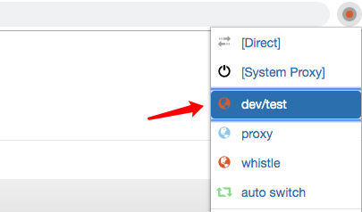

# 蓝鲸容器管理平台SaaS产品层（BCS-APP）安装部署文档

建议先部署[bcs-cc](/docs/install/dev-install-bcs-cc.md)和[bcs-projmgr](/docs/install/dev-install-bcs-projmgr.md)，再部署该模块

## 系统要求

- 数据库: mysql
- 缓存: Redis
- Python版本:3.6+
- NodeJS: 10.15


## 本地开发环境搭建步骤

### 前端开发环境搭建

#### 1. 安装依赖包
进入前端根目录下，安装依赖包

```bash
cd bcs-app/frontend
npm install .
```

#### 2. 本地启动frontend
- 复制 frontend 目录下的 index-dev.html.example 为 index-dev.html

| 变量名 | 说明 |
|-------|------|
| DEVOPS_HOST | 项目管理的地址|
| DEVOPS_BCS_API_URL | bcs-app 后台的API地址 |
| STATIC_URL | 静态资源地址。构建后，会根据这个值动态插入 js css 等静态资源 |
| DEVOPS_ARTIFACTORY_HOST | 镜像地址 |
| BK_CC_HOST | 查看业务和运维信息的地址 |
| SITE_URL | 前端路由的前缀，这个值会被设置为前端路由的根 |
| PROJECT_MESOS | MESOS 项目类型的值 |
| PROJECT_K8S | K8S 项目类型的值 |
| BK_IAM_APP_URL | 权限中心的地址 |
| document.domain | 登录弹框是一个 iframe，因此需要设置 document.domain，一般为项目地址的一级域名 |

注意：实际在生产环境中，使用的是 index.html，部分变量的值由后端服务渲染到文件中(配置index-dev.html时可参考)

- 配置启动端口

端口的具体配置在[config.js#L29](../../bcs-app/frontend/build/config.js#L29)，如设置成8004

- 启动frontend

```bash
cd bcs-app/frontend
npm run dev
```


#### 3. 安装和配置代理
bcs-projmgr 通过 iframe 的方式加载bcs-app，因此在本地单独开发 bcs-app 前端页面时，可以借助 Proxy SwitchyOmega (推荐chrome插件) 和 whistle 配置代理，将 iframe 的 src 指向本地。具体步骤如下：
- 安装 [Proxy SwitchyOmega](https://chrome.google.com/webstore/detail/padekgcemlokbadohgkifijomclgjgif)，新增一个 PROFILES (如 `dev/test`)，配置如下图所示



- 安装和配置 whistle 

```bash
# 安装whistle
npm i whistle -g
# 启动 whistle
w2 start
# 查看 whistle 的帮助
w2 help
```
通过浏览器访问 `http://127.0.0.1:8899/`，打开 Rules 选项卡，新建 example 环境，填写域名配置。如图所示，其中 `BK_PAAS_HOST` 是社区版PaaS地址(如paas.bk.com)，8004是 frontend 的本地端口。具体的代理域名(图中的`dev.bcs.{ BK_PAAS_HOST }`)，你需要从 iframe 的 src 处获取。最终，`local-dev.bcs.{BK_PAAS_HOST}` 配置成 `127.0.0.1` 以便本地访问



- 浏览器访问设置

插件选中`dev/test`，代理配置生效，即可实时调试前端代码了



#### 4. 打包构建

```bash
# 如果只开发后端环境，可以一次性编译为静态文件
cd bcs-app/frontend
npm run build
```


### 后台开发环境搭建
- 后台使用python3.6+ 和 django 1.11(LTS版本)

#### 1. 创建数据库
```
# 创建数据库bcs_app

CREATE DATABASE IF NOT EXISTS bcs_app DEFAULT CHARACTER SET utf8 COLLATE utf8_general_ci;
```

#### 2. 开启python虚拟开发环境
- [virtualenv](https://virtualenv.pypa.io/en/latest/userguide/#usage)

```bash
# 虚拟环境, 自动进入virtualenv
mkvirtualenv bcs-app

# 进入bcs-app根目录
cd bcs-app

# 安装依赖
pip install -r requirements.txt

# 本地开发在安装下开发依赖
pip install -r requirements-dev.txt

# 修改配置文件, 配置数据库, redis, 域名等
# 其中的环境变量值可参考 docker-compose.yml 中 bcs-app 的 environment 配置
vim backend/settings/ce/dev.py

# 执行migration
python manage.py migrate

# 拉起服务, 可以使用其他的托管服务, 例如supervisor
python manage.py runserver 8000
```

| 变量名 | 说明 |
|-------|------|
| BK_PAAS_HOST |  当前社区版地址 |

#### 3. 配置本地 hosts
将后台API地址添加到hosts文件中 `127.0.0.1 dev.{BK_PAAS_HOST}`， 其中`{BK_PAAS_HOST}` 需替换成实际的域名

#### 4. 启动进程
```bash
# 启动API，静态资源托管主进程
python manage.py runserver 8000
# 启动celery后台任务进程
python manage.py celery worker -l info
# 启动WebConsole后台进程
python -m backend.web-console
```

#### 5. 访问页面
通过 http://dev.{BK_PAAS_HOST}:8000/ 访问应用

#### 6. 本地调试日志
- 标准输出： API 进程, celery 后台任务, web-console 后台进程， 这三个服务的日志默认定向到标准输出
- 日志文件： API 进程的日志会同时写入 bcs-app 目录下的 `app.log` 文件，可以通过这个查询历史日志

## 部署 BCS-APP 到生产环境
#### 1.  打包 APP
- 打包依赖 Docker，请先安装 Docker 环境，且保证 Docker, pypi, npm 源可用
- 依赖`rsync, tar, sed`命令
- 打包过程会拉取镜像，安装npm, pypi依赖包，编译前端等

```bash
# 进入app根目录
cd bcs_app

# 执行命令
scripts/publish/build.sh build_bcs_app
```
会在build目录生成一个bk_bcs_app-V{datetime}.tar.gz的包

#### 2. 上传版本并部署
前往你部署的蓝鲸社区版平台，在"开发者中心"点击"S-mart应用"，找到bk-bcs-app并进入详情。在"上传版本"中，点击"上传文件"后选中上一步打包生成的版本包，等待上传完成。然后点击"发布部署"，你就已经部署你最新的版本包了

## 部署 BCS-WebConsole 到生产环境
#### 1.  打包 WebConsole
注意：`依赖rsync, tar命令`
```bash
# 进入app根目录
cd bcs_app

# 执行命令
scripts/publish/build.sh build_web_console
```
会在build目录生成一个bcs_web_console-ce-{datetime}.tar.gz的包

#### 2. 替换已经安装的社区版
- 参考[开源bk-bcs-saas替换社区版部署指南](xxx)替换BCS-WebConsole
