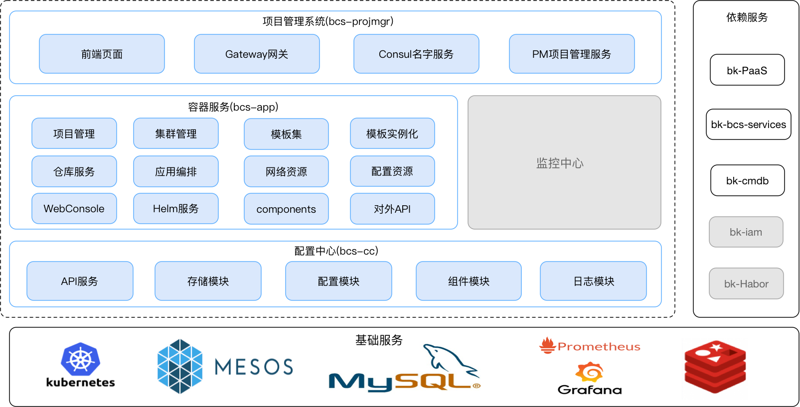

# 蓝鲸智云容器管理平台SaaS架构设计
## 蓝鲸智云容器管理平台介绍

蓝鲸容器管理平台给用户提供了高度可扩展、灵活易用的容器管理服务。平台支持两种不同的集群模式，分别是原生Kubernetes模式和基于Mesos的自研模式。使用平台的容器服务，用户只需在页面上进行简单的配置，就可以完成业务集群的搭建部署和容器的编排调度功能，同时平台还提供了丰富的配套系统(如监控中心)，方便用户更有效地掌控各类资源的状态，提升业务稳定性。

## 蓝鲸智云容器管理平台SaaS架构

上图是蓝鲸容器管理平台的逻辑架构图，容器管理平台SaaS作为其中的上层产品，包含已开源的`项目管理系统(bcs-projmgr)`、`容器服务产品层主体功能模块(bcs-app)`、底层的`配置中心模块(bcs-cc)`以及未开源的`监控中心`，同时它也依赖蓝鲸体系下的其他产品服务。

SaaS依赖的服务介绍：
- [bk-PaaS](https://github.com/Tencent/bk-PaaS): 蓝鲸PaaS平台。PaaS平台给容器管理平台SaaS提供了4大服务(统一登录、开发者中心、esb和应用引擎)，其中bcs-app由应用引擎托管
- [bk-bcs-services](https://github.com/Tencent/bk-bcs): 蓝鲸容器管理平台底层服务。作为后台服务，bk-bcs-services给bcs-app提供了集群搭建，应用编排等丰富的底层接口
- [bk-cmdb](https://github.com/Tencent/bk-cmdb): 蓝鲸配置平台。bcs-app的集群管理功能涉及的业务和主机信息来源于配置平台
- bk-iam: 蓝鲸权限中心。容器管理平台SaaS基于bk-iam，实现了用户与平台资源之间的权限控制
- bk-Habor: 蓝鲸容器管理平台镜像仓库服务。bcs-app使用bk-Habor提供的api，实现了业务镜像的查询与配置功能
