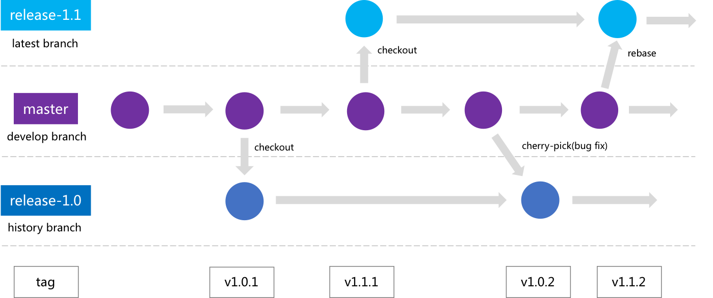

# 版本迭代说明

## 版本号

蓝鲸智云容器管理平台SaaS的版本号共分为3段，依据整个项目的迭代节奏进行管理。

版本号示例：v1.0.2

* 第一段：  
    1代表整个蓝鲸智云容器管理平台SaaS的大版本，目前是1。只有在进行大的版本调整时才会变更此位。
* 第二段：  
    0代表一个版本迭代周期，该周期内会包含一个或多个新的特性需求，或者是大的结构调整。当迭代周期向前演进时会进行调整。
* 第三段：  
    2代表当前的迭代周期，包含了一个特性、多个bugfix等内容。随着开发节奏不定期进行调整。一般为1~3周的周期。

## 版本管理

容器管理平台SaaS是一个基于版本发布的项目，它借鉴Gitlab flow的思路进行版本管理：
- `master` 作为“上游”分支，是开发分支。只有master采纳的代码变化，才能应用到其他分支
- `release-版本号`(如release-1.0)分支是1.0版本的最新分支。发版本时，从master分支checkout，并基于此分支打tag发release包
- 正常开发迭代过程, `个人`只需要同步主项目, 从master分支切出自己的开发分支, 提PR合并到主项目的master分支。其他所有分支，均由项目管理员进行统一维护
- 每个版本需要走具体的版本规划
