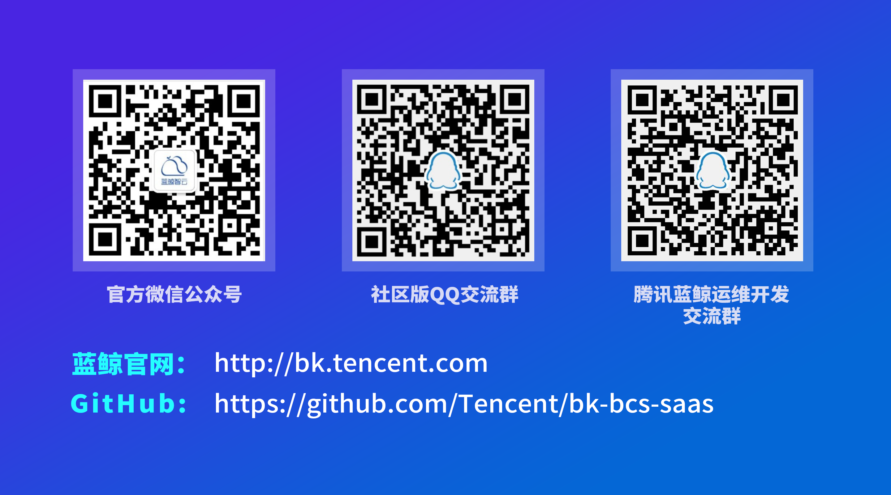

# SaaS of BlueKing Container Service

---
    

[(Chinese Documents Available)](README.md)

BlueKing Container Service（BCS）is a highly scalable, flexible and easy-to-use container management service. BCS supports two different cluster modes, the native Kubernetes mode and the Mesos self-developed mode. With this platform, users do not need to pay attention to the installation, operation and maintenance of the infrastructure, just call a simple API, or simply configure the page to start, stop, etc. the container, view clusters, containers and services. The state, as well as the use of various component services. Users can choose the cluster mode and container orchestration according to their own needs to meet the specific requirements of the business.

This open source is the SaaS of BCS, which is the BCS product layer service. It provides a friendly interface for visualizing the project cluster, nodes, namespaces, deployment configuration, docker registry, application, etc. Operation management, and provides a command line service that WebConsole can quickly view the status of the cluster. It supports the deployment and management of K8S applications using Helm for K8S cluster mode.

The SaaS source code of BCS contains:
- bcs-app：SaaS product layer main function module, responsible for project interface, node, namespace, deployment configuration, warehouse image, application, etc. for visual interface operation management, and services such as WebConsole, Helm, etc.
- bcs-cc：Configure center module to manage information such as cluster version and snapshot.
- bcs-projmgr：Project information management module, responsible for project creation and basic information management.

## Overview

- [Architecture(In Chinese)](docs/overview/architecture.md)
- [Code directory(In Chinese)](docs/overview/project_codes.md)
- [Deployment topology(In Chinese)](docs/overview/project_deploy.md)

## Features
- **Cluster management**：Supports custom setting of Master and Node nodes, automatically installs cluster components with one button, and divides clusters according to business structure to ensure security and reliability. Support dynamic scaling, which can add/remove cluster nodes in real time, support cluster and node level monitoring alarms and view display of main data.
- **Configuration management**：Support multi-version management of configuration template sets, support managing different environments through namespaces
- **Application management**：View the online status of apps, PODs, containers, and more by managing containers through app views or namespace views. Start and stop the container, re-schedule the container, and expand and shrink the application, scroll and upgrade, etc.
- **Docker registry**：Online management of docker registry.
- **Network management**：View a list of services, as well as details of each service, and operate on the service, such as updating the service or stopping the service. View the online load balancer list and the details of each load balancer to start, delete or update the load balancer.
- **WebConsole**：Quickly view cluster state command line tool services.
- **Helm**：Support for deployment and management tools for K8S applications Helm.

## Getting started
- [Local development and installation guidelines(In Chinese)](/docs/install/dev-install-overview.md)
- [Replace the installed ce version](https://docs.bk.tencent.com/bk_osed/Open-Bcs.html#open_bcs)

## Roadmap

- [Release log](docs/release.md)

## Support

- [White paper](https://docs.bk.tencent.com/bcs/)
- [Bk club](https://bk.tencent.com/s-mart/community)
- Contact us, technical exchange QQ group：

## BlueKing Community
- [BK-CI](https://github.com/Tencent/bk-ci)：a continuous integration and continuous
 delivery system that can easily present your R & D process to you.
- [BK-BCS](https://github.com/Tencent/bk-bcs)：a basic container service platform which provides
 orchestration and management for micro-service business.
- [BK-CMDB](https://github.com/Tencent/bk-cmdb)：BlueKing Configuration Platform (Blue Whale CMDB) is an enterprise-level configuration management platform for assets and applications.
- [BK-PaaS](https://github.com/Tencent/bk-PaaS)：an development platform that allows developers to create, develop, deploy and manage SaaS applications easily and quickly.
- [BK-SOPS](https://github.com/Tencent/bk-sops)：an lightweight scheduling SaaS  for task flow
 scheduling and execution through a visual graphical interface. 
- [BK-CMDB](https://github.com/Tencent/bk-cmdb)：an enterprise-level configuration management platform for assets and applications.

## Contributing

For bk-bcs-saas branch management, issues, and pr specifications, read the [CONTRIBUTING(In Chinese)](docs/CONTRIBUTING.md)

If you are interested in contributing, check out the [CONTRIBUTING.md], also join our [Tencent OpenSource Plan](https://opensource.tencent.com/contribution).

## FAQ

[FAQ](docs/faq.md)

## License

bk-bcs-saas is based on the MIT protocol. Please refer to [LICENSE](LICENSE.txt).
